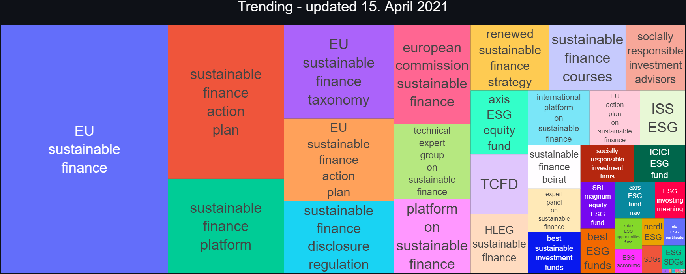
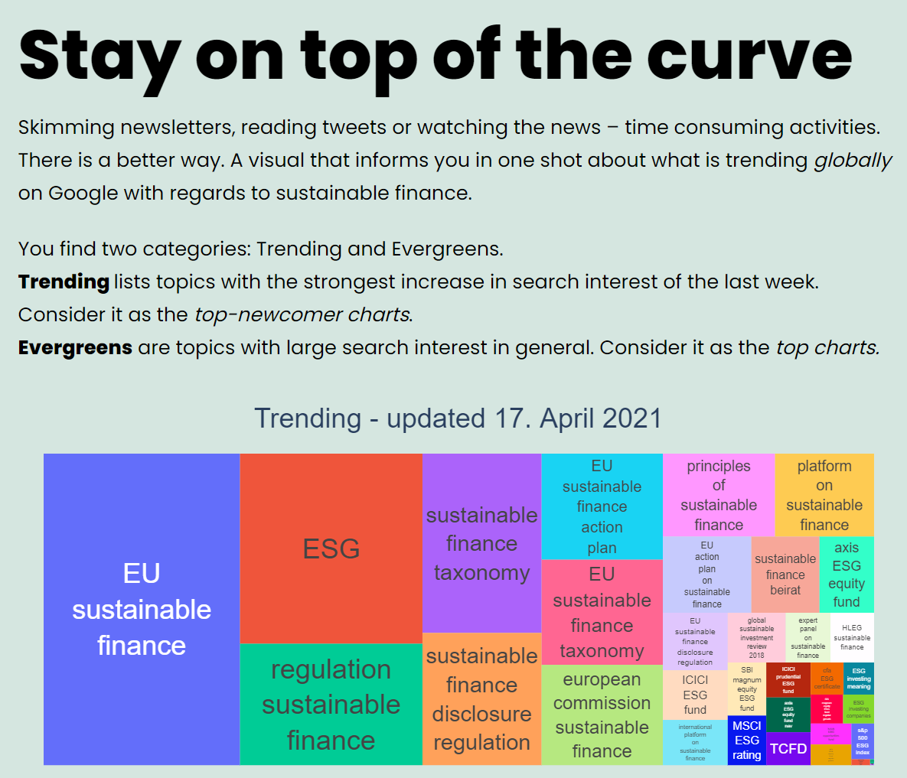

# ESG trending topics

__Goal__ 
> Stay ahead of the curve in ESG and sustainable finance topics. Stay informed with a dashboard on what is trending on Google.

__Deployed__ on Streamlit sharing: https://share.streamlit.io/philippschmalen/esg-trending-topics-radar



__In production__ on [towardssustainablefinance.com](http://www.towardssustainablefinance.com/):  http://www.towardssustainablefinance.com/2021/03/19/trending-topics-in-sustainable-finance/



--- 

## Getting started

To run a local instance, follow the steps: 

```bash
# create conda virtual environment
conda env create -f serve/env.yml
# activate environment
conda activate esg_trend
```

The `requirements.txt` is solely for deploying to _Streamlit sharing_. Use `./serve/requirements.txt` if hosting on a Linux instance.

__Note:__ You need a Chart Studio account configured with your credentials. Refer to the official docs, for details: [see here](https://plotly.com/python/getting-started-with-chart-studio/).

```bash
# to run the source-to-plot pipeline
python /pipelines/pipelines.py

# run streamlit app
streamlit run streamlit_app.py
```

### Hosting on a linux instance

Assuming that you are at the project root directory `./`:

```bash
# install packages
pip install -r serve/requirements.txt

# configure chart-studio credentials
python3
>>> import chart_studio
>>> chart_studio.tools.set_credentials_file(username='DemoAccount', api_key='lr1c37zw81')
>>> exit()

# run prefect pipeline with scheduler 
python3 pipelines/pipelines.py &
```

---

### Prefect pipeline for sourcing google trends

Either run `./pipelines/pipelines.py` or __on Windows__ you can execute it via a batch file.

Edit `./pipelines/run.bat` 

```bash
[...]
# set path to your python executable
set CONDAPATH=C:\Users\YOURUSERNAME\PATHTO\Miniconda3orAnaconda3
# set name of conda environment
set ENVNAME=esg_trend
[...]
```

Then you can execute `./pipelines/run.bat` to run the prefect pipeline.

### Folder structure
```bash
|   # project root where streamlit_app.py lives and requirements.txt
├───data
│   ├───0_external # where Google Trends data lives
│   ├───1_interim # any data that needs to be temporarily stored
│   └───2_final # ready-made data for analysis
|
├───notebooks # jupyter notebooks for exploration only 
├───pipelines # prefect pipelines to query API, build plots and prepare analysis
|
│   ├───analysis_dashboard # utilities for streamlit app
│   ├───esg_trending_topics # utilities to source data from Google Trends
│   └───log
├───serve # anything serving-related, e.g. find env.yml for conda env 
└───streamlit_utils # find utilities for streamlit_app.py
```

## Prefect

The project relies on three main tasks: Data collection, preparation and  deployment. I use [Prefect](https://www.prefect.io/) to manage and execute these tasks and handle errors. The latter is crucial when we deal with any sort of queries that could fail. The Google Trends API sometimes returns errors due to rate limits, server timeout or an incorrect query which raises exceptions. Prefect not only manages them, but also allows me to build the project around tasks that easily modularize and can be exchanged. 

Beyond this, it enables me to think about further features I can add for the project. Suppose, I want to build other dashboards or even apps that take the same data input. All I have to add is another task that branches from the data collection step. Or I could extend the data collection and then create branches for each project feature. 

 <!-- TODO: add image of branches in prefect -->

## Discussion

### Possible extensions

#### Interactions

Add a clickable link which redirects you to Google and the keyword.  

#### Visually

Create large appealing tiles. 

Make tile background based on `keyword` with transparency for half pastel 
color and half photos. Photos can be a topic picture or abstract from pexels.

#### Data

Add more dimensions to be selected as tiles or dropdown menu. These could be region (`geo`) and platform specific like youtube (`gprop`). 

Other data sources are relevant as well, such as think tank publications or CEO addresses.   


1. Google search API
1. Google keywords API
1. Trending tweets
1. News headlines or articles
2. NGO reports or letters like the one from Larry Fink
3. official reports, such as Sustainable finance beirat


#### Query 

```python 
# get queries across geo and gprop
for geo in GEO:
    for gprop in GPROP:
#         build payload here
#         run query
#         store output

```


